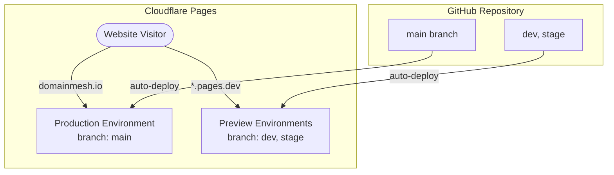
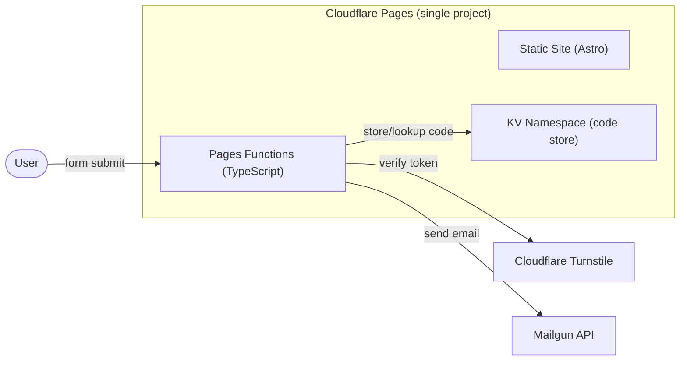

# DomainMesh Website

The official website for DomainMesh built as a highly optimized static site using **Astro**.
The site supports 15 languages out of the box.

## Why Astro?

We evaluated Hugo, Eleventy (11ty), and Astro for this project. Astro was selected as the optimal framework for the following reasons:
1. **Design-to-Code Workflow:** Astro's component syntax is extremely close to raw HTML (JSX-like), making it much easier to convert the Google Stitch design outputs into reusable components compared to Go templates in Hugo.
2. **Scoped Styling:** Every Astro component (`.astro`) has built-in scoped CSS, eliminating CSS naming collisions across the site.
3. **Future Interactive Flexibility (Islands):** While the site is purely static now, Astro's Islands Architecture allows us to drop in React, Svelte, or Vue components later without rewriting the site or shipping unnecessary JavaScript.
4. **Build Simplicity:** `astro build` outputs a clean `dist/` directory of pure HTML/CSS/JS that Cloudflare Pages deploys globally.

## Architecture & Hosting

The website is hosted on **Cloudflare Pages**, using a single project connected to the GitHub repository.



### How it Works

1. **Single Cloudflare Pages Project:** Connected to the GitHub repository.
2. **Production Branch (`main`):** Pushes to the `main` branch trigger a deployment to the production environment (`domainmesh.io`).
3. **Preview Branches (`dev`, `stage`, etc.):** Pushes to *any other branch* trigger a preview deployment with a unique preview URL.
4. **No CI/CD workflow needed:** Cloudflare automatically handles the `npm run build` step and deploys the `dist/` folder on every push.

### Environment Variables (Cloudflare Build Settings)

Cloudflare Pages distinguishes between the **Production** environment (the `main` branch) and the **Preview** environment (all other branches). We configure variables accordingly:

| Variable | Preview Environment (dev, feature-*, etc.) | Production Environment (main) |
|---|---|---|
| `PUBLIC_ENVTYPE` | `dev` | `prod` |

When `PUBLIC_ENVTYPE=dev`, an orange "🚧 DEV ENVIRONMENT 🚧" banner appears at the top of every page. This ensures the banner shows up on the `dev` branch and any other feature branch preview.

### Redirects

The root path `/` redirects to `/en/` (default locale). This is handled by:
- **On Cloudflare**: The `public/_redirects` file executes an instant server-side 301 redirect at the edge.
- **Locally**: Astro's `redirectToDefaultLocale: true` config handles this via a client-side redirect.

## Development

All local development tasks are managed via [Task](https://taskfile.dev/). Run `task` to see all available commands.

```bash
# Install dependencies
task install

# Start local dev server (with dev banner)
task devserver

# Build as dev (with banner)
task build-dev

# Build as prod (no banner)
task build-prod

# Preview the built site locally
task preview

# Clean build artifacts
task clean
```

### Local Workflow

1. `task devserver` → Code with hot reload at `http://localhost:4321/en/`
2. `task build-dev` + `task preview` → Verify the production build behavior locally at `http://localhost:4322/en/`
3. `git push` → Cloudflare auto-deploys.

## Versioning & Release Strategy

### Versioning Scheme
We use **Semantic Versioning (semver)** (`vMAJOR.MINOR.PATCH`) to version the website.

### Automated Git Workflow
We use [Conventional Commits](https://www.conventionalcommits.org/) and a **GitHub Actions workflow** (`.github/workflows/release.yml` using the Release Please action) to 100% automate website versioning and changelogs.

1. **Development (`dev` branch):** All daily work and PRs merge into `dev`. Every push to `dev` automatically deploys to the preview environment on Cloudflare Pages.
2. **Cutting a Release (`stage` branch):** When ready to release, `dev` is merged into `stage`. The GitHub Action runs against `stage` and automatically opens a Release Pull Request bumping the `package.json` version and generating a `CHANGELOG.md`.
3. **Version Finalization:** Merge the Release Pull Request into `stage`. The GitHub Action generates a GitHub Release and a formal `v*` tag. The code on `stage` is now perfectly versioned.
4. **Production Deployment (`main` branch):** Fast-forward merge `stage` into `main`. The `main` branch is updated and Cloudflare Pages auto-deploys the versioned release exactly once to the production environment.

> ⚠️ **NEVER merge `stage → main` via a GitHub Pull Request.**
> GitHub PRs always create new commits (merge or squash), breaking the linear history.
> Always use `git merge --ff-only stage` from the CLI, or run `task promote-to-prod`.

### Commit Convention

We strictly follow [Conventional Commits](https://www.conventionalcommits.org/). See `.agents/workflows/git-commit-workflow.md` for the full specification.

### Version Display
- **Footer**: The current version is displayed next to the copyright: `© 2025. All rights reserved. · v1.3.0`
- **HTML Meta**: Injected into the `<head>` of all pages: `<meta name="version" content="v1.3.0">`

## API Backend (Pages Functions)

The contact form backend runs as **Cloudflare Pages Functions** — TypeScript functions that deploy automatically alongside the static site. No separate CI/CD or infrastructure needed.

### Architecture



**Contact form flow:**
1. User submits form → Turnstile bot check → API generates 6-digit code → stores in KV (10-min TTL) → sends code to user's email via Mailgun
2. User enters code → API verifies → sends contact notification to business inbox

### API Endpoints

| Endpoint | Method | Description |
|---|---|---|
| `/api/contact` | POST | Submit contact form (validates Turnstile, sends verification code) |
| `/api/contact-verify` | POST | Verify code and send contact email |

### Secrets & Environment Variables

- **Production & Preview:** All variables must be set in **both** the Production and Preview environments in the Cloudflare Dashboard (Pages → Settings → Environment variables).
- **Local development:** Same variables are stored in `.env` (gitignored). Copy `.env.template` to get started.

| Variable | Type | Production | Preview |
|---|---|---|---|
| `PUBLIC_ENVTYPE` | Plaintext | `prod` | `dev` |
| `PUBLIC_TURNSTILE_SITE_KEY` | Plaintext | *(same in both)* | *(same in both)* |
| `TURNSTILE_SECRET_KEY` | 🔒 Encrypted | *(same in both)* | *(same in both)* |
| `MAILGUN_API_KEY` | 🔒 Encrypted | *(same in both)* | *(same in both)* |
| `MAILGUN_DOMAIN` | Plaintext | *(same in both)* | *(same in both)* |
| `CONTACT_TO_EMAIL` | Plaintext | *(same in both)* | *(same in both)* |
| `CONTACT_FROM_EMAIL` | Plaintext | *(same in both)* | *(same in both)* |

### Cloudflare KV

The `CONTACT_KV` namespace stores verification codes with a 10-minute TTL. Codes auto-expire — no cleanup needed.

**Setup:**
1. Go to Build → Storage and Databases → Workers KV → Create a namespace named `contact-codes`
2. Go to Pages → your project → Settings → Bindings → KV namespace
3. Add binding: variable name `CONTACT_KV`, select the `contact-codes` namespace

### Cloudflare Turnstile

Bot protection on the contact form. The widget renders automatically in dark theme.

- **Site Key** (public, build-time): set as `PUBLIC_TURNSTILE_SITE_KEY` env var
- **Secret Key** (server-side, runtime): set as `TURNSTILE_SECRET_KEY` env var

**Hostname setup (Turnstile Dashboard → Widget → Hostnames):**

The following hostnames must be registered for the Turnstile widget to work:

| Hostname | Purpose |
|---|---|
| `domainmesh.io` | Production |
| `domainmesh-website.pages.dev` | Cloudflare Pages previews (covers all `*.pages.dev` subdomains) |
| `localhost` | Local development |

> **Note:** After adding or changing hostnames, there is a short propagation delay (a few minutes) before Turnstile accepts the new domain. If you see error 110200, wait and retry.

### Mailgun

Email delivery for verification codes and contact notifications. Free tier: 100 emails/day.

> **Important:** Our Mailgun account is in the **EU region**. The API endpoint in `mailgun.ts` must use `api.eu.mailgun.net` (not `api.mailgun.net`). Using the US endpoint returns `401 Forbidden`.

**Setup:**
1. Create a Mailgun account (EU region) and verify your sending domain
2. Generate a **Private API key** (starts with `key-...`) and set it as `MAILGUN_API_KEY` in Cloudflare Dashboard
3. Ensure SPF, DKIM, and MX records are verified (green) in Mailgun → Sending Domains
4. Add a DMARC DNS record to improve deliverability and avoid spam classification:
   ```
   _dmarc.domainmesh.io  TXT  "v=DMARC1; p=none; rua=mailto:hello@domainmesh.io"
   ```

### Local Development

```bash
# First time: copy the template and fill in your values
cp .env.template .env

# Build the site first
task build-dev

# Run Pages Functions locally with KV emulation
task api-dev
```

The `.env` file is gitignored. For Turnstile, the template pre-fills the always-pass test key.
Production secrets live exclusively in the Cloudflare Dashboard — they are never in `.env` or GitHub.
